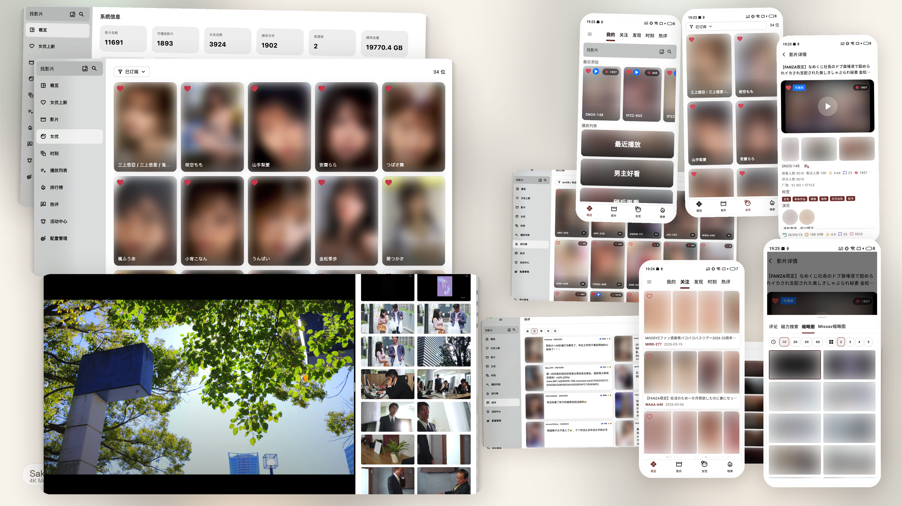

  

<h1 align="center">SakuraMedia</h1>

  收藏久了，我开始在意：这部影片里，我究竟想留下什么？ 
  <a href="https://tinypinglite.github.io/sakuramedia/guide/collection-strategy"><strong>为什么做 SakuraMedia：让喜欢的内容留下来 →</strong></a>

  

  <a href="https://tinypinglite.github.io/sakuramedia/"><strong>查看 Wiki</strong></a>
  ·
  <a href="https://tinypinglite.github.io/sakuramedia/guide/quick-start"><strong>快速开始</strong></a>
  ·
  <a href="https://tinypinglite.github.io/sakuramedia/guide/plugin-development"><strong>插件开发</strong></a>
  ·
  <a href="https://github.com/tinypinglite/sakuramediabe"><strong>后端项目</strong></a>

## 核心功能

- 🔍 **发现与追踪**：按番号搜索影片、按姓名查找女优，通过标签、排行榜和推荐逛内容；订阅女优后持续追踪她的新作。
- 📥 **订阅与自动入库**：订阅影片后，系统定期寻找合适资源、提交下载，并在完成后自动导入媒体库；暂无资源的影片可以先留在订阅清单里等待。
- 🎬 **独立 APP + 缩略图辅助观影**：SakuraMedia 客户端内置缩略图时间轴，把影片画面按时间展开，点击即可跳到对应画面，快速预览场景、定位精彩片段；配合倍速、字幕与续播，也支持调用外部播放器。
- 🖼️ **以图搜图**：用喜欢的画面或文字描述检索库内相似内容（可选功能）。
- ❤️ **收藏与整理**：用播放列表、时刻、切片和各自的合集，留下想回看的画面与片段。
- 🗂️ **媒体库管理**：查看重复文件、多版本和失效媒体，并可在支持的存储之间迁移，保留媒体记录与播放进度。
- 🧬 **文件指纹**：专属的采样指纹算法，只读取少量文件片段就能快速识别重复媒体，跨媒体库、跨存储都适用。
- 🔔 **任务与通知**：集中查看下载、导入和后台任务的进度与结果，通过通知接收提醒，并提供扩展机制可接入多种通知渠道。
- 💾 **可扩展的存储与下载**：目前支持本地存储 + qBittorrent，以及 115 网盘并配置 115 离线下载；存储与下载能力通过插件接入，后续可继续扩展。
- 🧩 **插件化扩展**：提供多种插件能力机制，排行榜来源、字幕获取和女优资料补全等能力，都可以通过插件按需启用。
- 💻 **多客户端**：通过flutter开发，提供 Windows、macOS、iOS、Android 客户端；

## 社区支持

- 发现 Bug：[提交 Issue](https://github.com/tinypinglite/sakuramedia/issues)
- 使用交流或求助：[参与 Discussions](https://github.com/tinypinglite/sakuramedia/discussions)

- **项目当前处理快速迭代阶段， 如遇问题可尝试将前后端以及各个插件升级到最新版本**

## 参与贡献

此项目不需要捐赠，如果对你有用，可以点个Star，如果你想要帮助改进这个项目，可以通过以下方式参与进来：

- 帮助撰写和改进Wiki
- 开发新的插件扩展新功能，可以查看[插件开发文档](https://tinypinglite.github.io/sakuramedia/guide/plugin-development.html)
- Bug修复 / 新功能 PR

<h2 align="center">风险与声明</h2>

- **SakuraMedia 当前仍处于快速迭代阶段，不保证任何功能可用性及历史版本兼容性**。
- 本项目不提供任何媒体资源内容的存储、下载、分发。
- 请确保你的使用行为符合所在地法律法规与版权要求。
- 如有侵权，请联系：tinyping@protonmail.com。
- 使用本项目产生的一切后果由使用者自行承担，与项目作者无关。
- License: [GNU GPL v3](./LICENSE)

<h2 align="center">Star History</h2>

  <a href="https://github.com/tinypinglite/sakuramedia/stargazers">
    <picture>
      <source media="(prefers-color-scheme: dark)" srcset="https://tinypinglite.github.io/sakuramedia/star-history-dark.svg" />
      <source media="(prefers-color-scheme: light)" srcset="https://tinypinglite.github.io/sakuramedia/star-history-light.svg" />
      
    </picture>
  </a>

